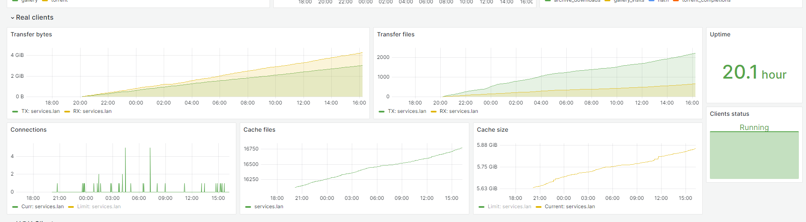

# H@H client with prometheus metrics

## About
This is fork of original [H@H 1.6.1](https://repo.e-hentai.org/hath/HentaiAtHome_1.6.1_src.zip) from [e-hentai.org](https://e-hentai.org/). You can compare this code with branch `SRC_1.6.1`

Some code used from [this post (roundpixl)](https://forums.e-hentai.org/index.php?showtopic=255336)

> `docker-compose` example located in [docker-compose.example](./docker-compose.example)

## Configuration
Added some cli args:
- `--metrics-name=<value for labels>` default: ""
- `--metrics-user=<value for labels>` default: ""
- `--metrics-address=<listening ip>` default: "127.0.0.1"
- `--metrics-port=<metrics port>` default: "9100"
- `--enable-metrics=<true|false>` default: "false"

## Metrics

|Name|Desc|Labels|Type|
|----|----|------|----|
|eh_hath_client_status|Client Status|user, name, host|gauge|
|eh_hath_client_uptime_seconds|Client uptime in seconds|user, name, host|counter|
|eh_hath_transfer_tx_files_count|Amount of files sent since last restart|user, name, host|counter|
|eh_hath_transfer_rx_files_count|Amount of files received since last restart|user, name, host|counter|
|eh_hath_transfer_tx_bytes|Bytes sent since last restart|user, name, host|counter|
|eh_hath_transfer_rx_bytes|Bytes received since last restart|user, name, host|counter|
|eh_hath_cache_size_limit_bytes|Reserved maximal cache size|user, name, host|gauge|
|eh_hath_cache_size_bytes|Cache size|user, name, host|gauge|
|eh_hath_cache_size_free_bytes|Free space reserved for H@H cache|user, name, host|gauge|
|eh_hath_cache_size_used_ratio|How much of the reserved cache is already in use|user, name, host|gauge|
|eh_hath_cache_file_count|Count of files currently in client cache|user, name, host|counter|
|eh_hath_connections_open_count|Currently open connections to the client|user, name, host|gauge|
|eh_hath_connections_max_count|Max connections|user, name, host|gauge|
|eh_hath_last_server_contact_epoch|Epoch timestamp of last server contact|user, name, host|counter|

`eh_hath_client_status` values:
- 0 - Unknown
- 10 - Suspended
- 20 - Running

Label values:
- user - arg `--metrics-name=$METRICS_CLIENT_NAME`
- name - arg `--metrics-user=$METRICS_USER_ID`
- host - resolved from command server

> ### For more metrics you can also use [EH_metrics](https://github.com/mixa3607/EH_metrics) project

### Grafana sample dashboard

